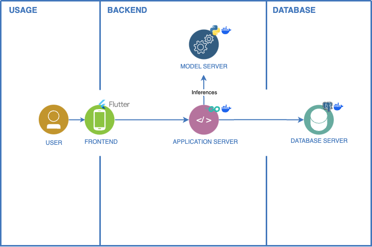

# SIT_AY24-25_CSC3101

## Introduction
This project serves as a proof of concept for addressing the [issue of contaminated recyclables](https://www.nea.gov.sg/media/news/news/index/new-bloobin-ai-chatbot-to-help-public-recycle-right) in Singapore's recycling bins (Bloobin). Using the [YOLO11s-seg model](https://docs.ultralytics.com/tasks/segment/), it provides real-time feedback on the recyclability and cleanliness of items, aiming to reduce contamination. While the model is still in its early stages, with limited examples and not yet at optimal performance, this project demonstrates the potential to improve recycling habits through feedback and incentivized rewards. Further development is required to enhance accuracy and usability, but it lays the groundwork for a more effective recycling system.

## Demo

## Architecture

The architecture follows a microservices model with three key servers:

- **Application Server** (Go): Handles API requests, business logic, and frontend-backend communication.
- **Model Server** (Python): Runs a deep-learning model for recycling material analysis and contamination detection.
- **Database Server** (PostgreSQL): Stores user profiles, recycling data, and contamination assessments.

All servers are containerized for scalability and maintainability, with a distributed design for load balancing and modular updates.

## Running Application
### Dependencies
1. [Docker](https://www.docker.com/)
2. [Make](https://www.gnu.org/software/make/#download)  
   > Alternatively, use a package manager like Brew (Mac) or Chocolatey (Windows)

### Execution
1. Open Docker Desktop
2. Execute `make run` command in terminal

### Clean ups
1. Execute `make clean` command in terminal